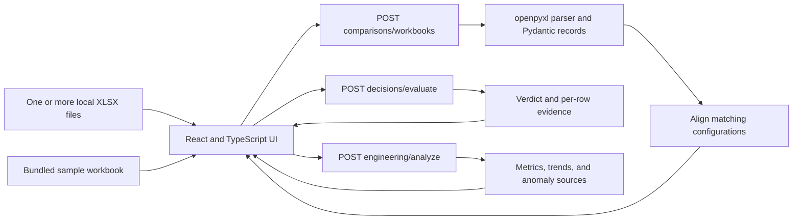

# Task 1: design and operating assumptions

Performance Studio turns uploaded performance projections into a workload
decision for a customer and a traceable inspection for an engineer. The
[live app](https://ai-model-quality-challenge-rho.vercel.app) accepts new sweeps
without a rebuild. The [root README](../README.md) contains the full local launch
path; [deployment documentation](vercel-deployment.md) describes public routing.
This document describes the implemented product and its rationale, rather than
claiming a historical evaluation of frameworks that was never recorded.

## The two audience problems

A customer or customer-facing PM needs to ask: "Can this model handle my input,
output, and cache scenario at my capacity, generation-speed, and TTFT limits?"
The customer view emphasizes those familiar units and shows GO, NO GO, or
NEEDS DATA with the actual values behind the result. Optional context and
hardware cost checks require explicit assumptions. Comparing multiple models
uses the same scenario, targets, and assumptions for each model.

An engineer needs to ask: "Which projected configuration supports that answer,
how does it change with batch size, and what deserves investigation?" The
engineering section exposes aggregate/per-box/cached/uncached metrics,
controlled trends, source references, and deterministic anomaly rules. It
preserves raw values even when a flag warrants review. A flag is a prompt for
investigation, not automatic proof of an invalid projection.

Both audiences share one upload and comparison flow because they need the same
data and configuration alignment. Their sections then expose different detail.
The comparison table highlights capacity, generation speed, and TTFT for
customers and adds per-box/cache-sensitive metrics for engineers. Shared upload
diagnostics prevent each audience from making a decision from an excluded file.

## Architecture and data flow

All API paths in the diagram are prefixed `/api/v1/`.

| Responsibility    | Implementation                                                                                                                                    |
| ----------------- | ------------------------------------------------------------------------------------------------------------------------------------------------- |
| Workbook parsing  | `backend/src/perf_api/parser.py`: `Summary` sheet, row-2 headers, row-3 onward; forward-fill input/output/cache fields used by merged cells       |
| Typed contract    | `schemas.py`, `comparison_schemas.py`, `decision_schemas.py`, `engineering_schemas.py`                                                            |
| Comparison        | `comparison.py`: align by profile, input/output lengths, cache fraction, and batch size; report missing coverage and conflicting/ambiguous sweeps |
| Customer rules    | `decision.py`: evaluate each eligible row as a complete configuration against supplied thresholds                                                 |
| Engineering rules | `engineering.py`: sourced metrics, matching batch/cache trends, decomposition and scaling review flags                                            |
| HTTP boundary     | `main.py` and `routes/`: FastAPI multipart uploads, JSON decisions/diagnostics, health endpoint                                                   |
| UI                | `frontend/src/App.tsx`, `ComparisonView.tsx`, `DecisionView.tsx`, `EngineeringView.tsx`: shared upload state and separate audience sections       |
| Hosting           | Root `vercel.json`: Vite static frontend and FastAPI service on one public domain                                                                 |

The browser holds normalized uploads in current page state and sends them to
the decision/engineering endpoints. The backend processes requests in memory;
there is no application database, account system, or saved-upload history.
Reloading loses the current workspace. Locally Vite proxies API calls; on Vercel
public rewrites route `/api/*` and `/health` directly to FastAPI. Same-origin
calls avoid requiring a separate CORS configuration. No API credentials are
needed. The bundled sample passes through the same upload API as a user file.

Model/profile identifiers are derived dynamically from workbook filenames.
Unrecognized naming falls back to a filename-derived model and `unknown`
profile. That supports new model letters such as L without a model registry;
it does not imply support for arbitrary workbook structures.

## Framework choice and alternatives

React with TypeScript fits an interface with shared uploads, multiple selectors,
per-model verdicts, and independent loading/error states. TypeScript describes
the frontend contracts; FastAPI/Pydantic validates the server boundary. Vite
keeps the SPA build and local proxy small. FastAPI with openpyxl keeps Excel
parsing and numerical rules together in Python, separate from rendering.
The trade-off is maintaining two languages and installing two toolchains.

| Alternative                             | Why it was not used for this implementation                                                                                 | What it would offer                                                                           |
| --------------------------------------- | --------------------------------------------------------------------------------------------------------------------------- | --------------------------------------------------------------------------------------------- |
| Streamlit / Gradio                      | Custom comparison layouts, focus behavior, and the two audience flows fit explicit React components better                  | A faster Python-only prototype                                                                |
| Next.js                                 | Server rendering and SEO add little to an upload-driven application; the existing Python API already owns server processing | Integrated React server features if the product later needs accounts or server-rendered pages |
| Browser-only React with an XLSX library | Parsing and diagnostic rules would move into JavaScript and lose the existing typed Python API boundary                     | Static-only hosting and no server upload payload limit                                        |
| A static workbook export                | Cannot ingest unseen uploaded sweeps or evaluate new customer targets live                                                  | Very simple distribution for a fixed report, which does not meet this challenge               |

These are architectural reasons, not benchmarked superiority claims. Vercel
was chosen to provide the required public URL with a single-domain frontend/API
deployment. A continuously running Python host would be another option if
payload sizes or cold-start behavior became constraints.

## What was cut, and why

- Accounts, saved projects, billing, and collaboration: the core review path is
  upload → compare → decide → inspect; persistence would add infrastructure
  without establishing the projection-to-decision logic.
- Model quality rankings and automatic model selection: the sweeps measure
  performance projections and contain no quality evaluation. A faster model
  is not thereby a better answer generator.
- Interpolation and extrapolation: a scenario needs matching rows. Filling gaps
  would produce unvalidated performance claims, so missing coverage stays visible.
- Customer-facing exposure of every source column: capacity, generation speed,
  TTFT, and optional context/cost carry the decision; implementation details belong
  in engineering inspection.
- A customer price quote or automatic context discovery: no pricing or maximum
  context metadata is supplied, so both require stated caller assumptions.
- Large-scale streaming uploads, persistent processing jobs, and production
  telemetry: they are future work; the current synchronous flow is sized for
  the supplied sweeps and the deployed platform's payload limits.

## Assumptions and their consequences

| Assumption                                      | Implemented behavior / consequence                                                                                                                                 |
| ----------------------------------------------- | ------------------------------------------------------------------------------------------------------------------------------------------------------------------ |
| Workbook shape is the contract                  | The parser requires the named Summary columns and usable numeric values; arbitrary spreadsheets are not supported                                                  |
| Cache is a fraction                             | A source value `0.5` means 50%; it is not an observed production cache-hit rate                                                                                    |
| Same scenario is necessary for comparison       | Different input/output/cache/batch/profile combinations are not ranked as directly comparable                                                                      |
| A projected row is indivisible                  | A verdict cannot combine one row's capacity with another row's speed to manufacture a pass                                                                         |
| Threshold equality passes                       | Capacity and generation speed use `>=`; TTFT and estimated cost use `<=`                                                                                           |
| A missing fact remains unknown                  | No thresholds or missing required context/price information may produce NEEDS DATA; blanks are not zero                                                            |
| A GO means an available projected configuration | It does not establish a production SLA, quality level, tail latency, or optimal configuration; the first passing row follows workbook order                        |
| All rows failing known checks means NO GO       | The representative row minimizes failed checks, with source-order ties; all row evidence remains available                                                         |
| Context must be supplied explicitly             | Input plus output length is the scenario requirement, not proof of the supported context ceiling                                                                   |
| Cost assumes sustained projected capacity       | `box_hour_price * 1,000,000 / (throughput_per_box * 3,600)` is hardware-only cost per million projected throughput tokens, excluding idle capacity and other costs |
| Total/per-box is a ratio                        | It is not a verified physical system count; workload and allocation metadata are absent                                                                            |
| Cached/uncached columns are reported components | Their observed sum is checked with tolerances; it is not evidence of a causal cache speedup                                                                        |
| Engineers interpret flags                       | Nonpositive throughput/TTFT/speed, decomposition mismatch, and >5% capacity drops on increased batch prompt review                                                 |
| Public hosting is request-based                 | The documented Vercel limit applies to the whole multipart upload and JSON response; uploads are not unlimited                                                     |

The supplied profiles vary length and cache together. There is no within-profile
cache-setting partner, so these files cannot isolate the effect of cache alone.
TTFT values as low as zero also need scrutiny; the UI displays projections
without treating them as measured network-inclusive latency. See the
[model/profile analysis](task1-models-and-profiles.md) for concrete findings.

## What changes with additional evidence or time

| Change                                        | Next implementation and decision impact                                                                                                                                                                                                                                                                 |
| --------------------------------------------- | ------------------------------------------------------------------------------------------------------------------------------------------------------------------------------------------------------------------------------------------------------------------------------------------------------- |
| More projection data                          | Add versioned schema/units metadata, model architecture/parameter counts, hardware allocation and precision, and broader scenario coverage. Establish controlled cache and batch experiments. Consider interpolation only after validating held-out errors and displaying uncertainty                   |
| Production measurements alongside projections | Join measured and projected records by scenario and serving configuration; show residuals and p50/p95/p99 TTFT, generation speed, capacity, and achieved cache behavior. Validate the decision rules on actual load, expose headroom, and distinguish measurement date from projection version          |
| More time                                     | Prioritize dependency maintenance and upload resource limits, then actual zoom/screen-reader checks, saved sessions with explicit retention controls, and clearer visual trend comparisons. Larger workloads may require asynchronous processing and storage; those changes should follow measured need |

The first production milestone would be calibration: determine how often a
projection-based GO actually satisfies a workload at its required latency and
capacity. Adding more visual polish before measuring that error would not
resolve the main uncertainty in customer decisions.

## Validation boundaries

[Issue #10 evidence](issue-10-evidence.md) covers fresh Model L, failure recovery,
and the scoped keyboard/accessibility audit. [Issue #11 deployment evidence](vercel-deployment.md)
covers the public product. [Issue #12 evidence](issue-12-evidence.md) records
fresh installation and local launch checks. Automated accessibility scans and
keyboard tests do not establish a screen-reader audit or actual 200% zoom.
The model-size estimates below are analysis-only and do not enter application
decisions or hard-code unseen model behavior.
